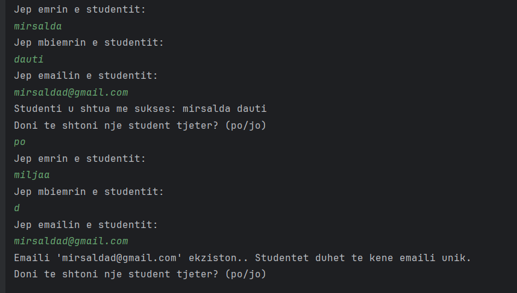
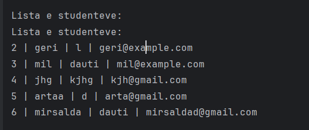
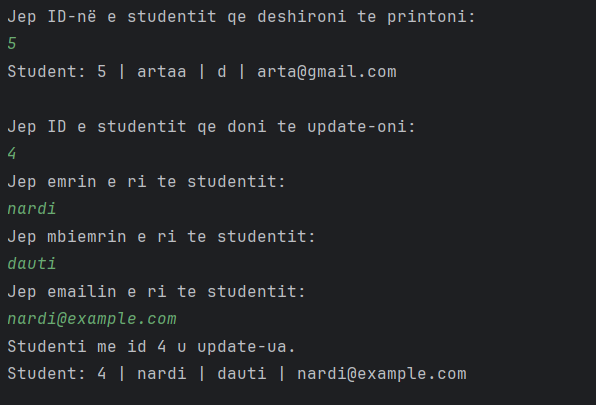
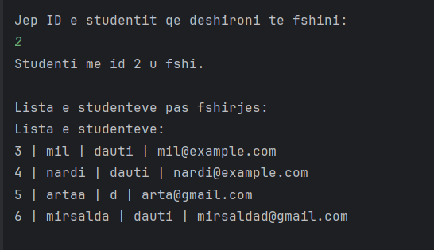
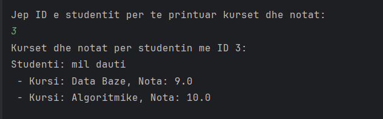

# Projekti i Menaxhimit te Studenteve

Ky projekt eshte nje aplikacion i thjeshte Java qe lidhet me nje baze te te dhenave PostgreSQL.
Ai krijon nje tabele per studentet dhe lejon te behet CRUD (Create, Read, Update, Delete) mbi te dhenat e tyre.
Programi siguron qe email-et e studenteve jane unike permes nje kontrolli specifik.
Perdoruesi shton te dhena te studenteve ne menyre interaktive nga consola.

## Si te ekzekutoni
1. Sigurohu qe PostgreSQL eshte i instaluar dhe i startuar.
2. Konfiguro lidhjen ne DBConnection.java sipas te dhenave tuaja te bazeve te te dhenave.
3. Ekzekuto Main.java per te startuar aplikacionin.
4. Ndiq udhezimet ne konsol per te shtuar, modifikuar apo fshire studentet.

## Funksionalitetet kryesore
- Krijimi i tabeles "student_test" nese nuk ekziston
- Shtimi i studenteve me kontroll te email-it unik
- 
- Shfaqja e listes se studenteve
- 
- Kerko student sipas ID
- Perditeso te dhenat e nje studenti
- 
- Fshi nje student nga baza
- 
- Shfaq kurset dhe notat e nje studenti 

