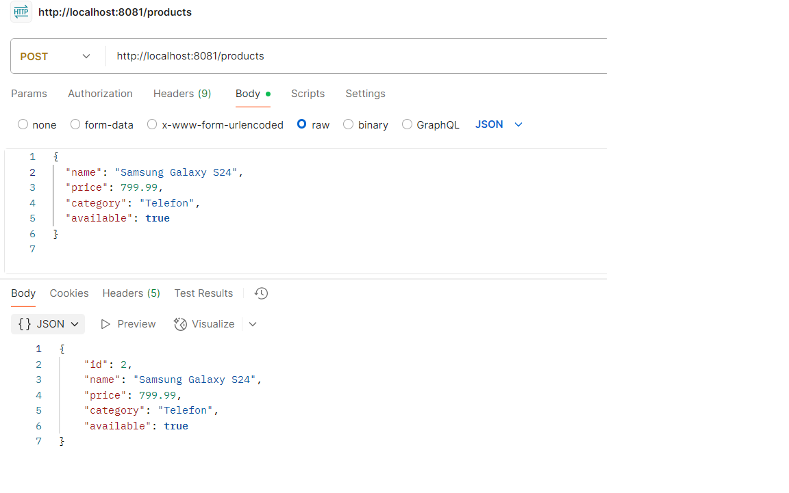

# Spring Boot Product CRUD API

Ky projekt eshte nje API e thjeshte per menaxhimin e produkteve duke perdorur **Spring Boot**, **Spring Data JPA** dhe **H2 Database** (ose ndonje database tjeter qe mund te konfiguroni).

## Funksionalitetet

- Krijimi i produktit (Create)
- Marrja e te gjithe produkteve (Read all)
- Marrja e nje produkti specifik me ID (Read one)
- Perditesimi i nje produkti ekzistues (Update)
- Fshirja e nje produkti (Delete)

## Teknologjite e perdorura

- Java 11+
- Spring Boot 2.7+
- Spring Data JPA
- H2 Database (in-memory) ose ndonje DB tjeter
- Maven (menaxhimi i dependencave)
- Postman (per testim API)

## Struktura e projektit

- `Product` - Entiteti qe perfaqeson produktin
- `ProductRepository` - Interface per aksesin ne te dhenat (CRUD)
- `ProductService` - Logjika e biznesit per produktet
- `ProductController` - Endpoint-et REST per CRUD operacionet

## Testimet e realizuara ne Postman per CRUD
- Shtimi i produkteve

- Printimi i te gjitha profukteve

-Printimi i nje produkti te vetem

-Update Product
