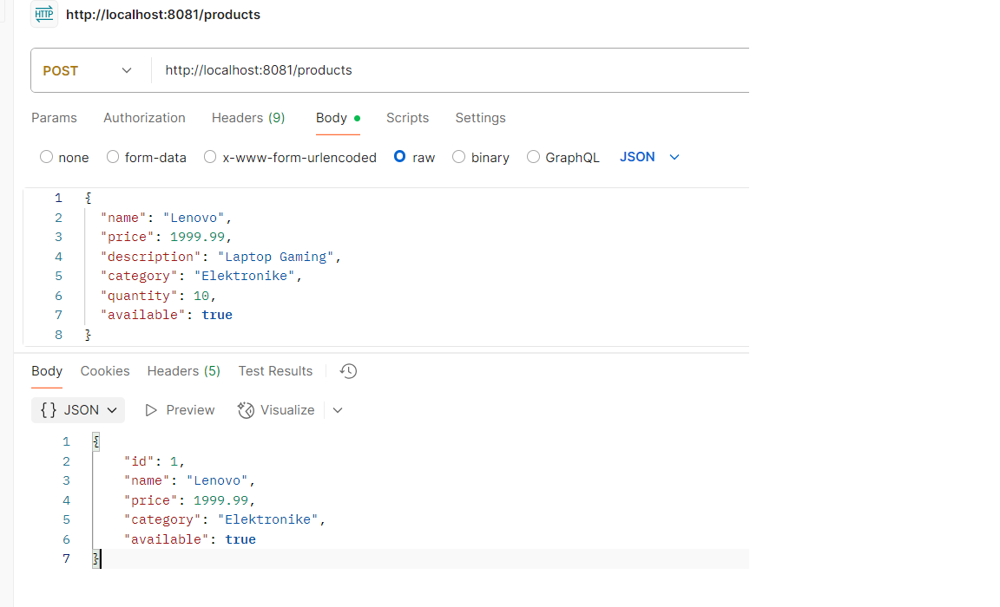

# Internship Controller

Ky eshte nje projekt Spring Boot me nje REST Controller qe ofron disa endpoint-e per pershendetje ne gjuhë te ndryshme.

## Endpoint-et

- **GET /hello**  
  Kthen "Hello World".

- **GET /static-message**  
  Kthen "Ky eshte nje mesazh statik!".

- **POST /greet?language=xx**  
  Kthen pershendetje ne baze te gjuhes (`en`, `sq`, `de`, `fr`).  
  Nese mungon parametri ose gjuha nuk mbeshtetet, kthen mesazh gabimi.

## Si ta nisesh

1. Krijo nje projekt Spring Boot (p.sh. me Spring Initializr) me dependency `Spring Web`.
2. Shto klasen `HomeController` ne paketen `dev.al.Internship.Controller`.
3. Nis aplikacionin ne IDE-n tende (IntelliJ, Eclipse, etj.).
4. Aplikacioni do te jete ne `http://localhost:8080`.

## Shembuj kerkesh

- `GET http://localhost:8080/hello` → "Hello World"
- `POST http://localhost:8080/greet?language=sq` → "Pershendetje!"

-  -![fig]
  -![fig]

## Testimi me Postman

- Hap Postman.
- Per kerkesat GET, krijo nje `GET` request me URL si `http://localhost:8080/static-message`.
-
-![fig]

- Per kerkesat POST, krijo nje `POST` request me URL si `http://localhost:8080/greet?language=en`.
- Shto parametra ne URL sipas nevojes (p.sh. `language=sq`).
- Dergo kerkesen dhe shiko pergjigjen ne Postman.
  ![fig]

---

